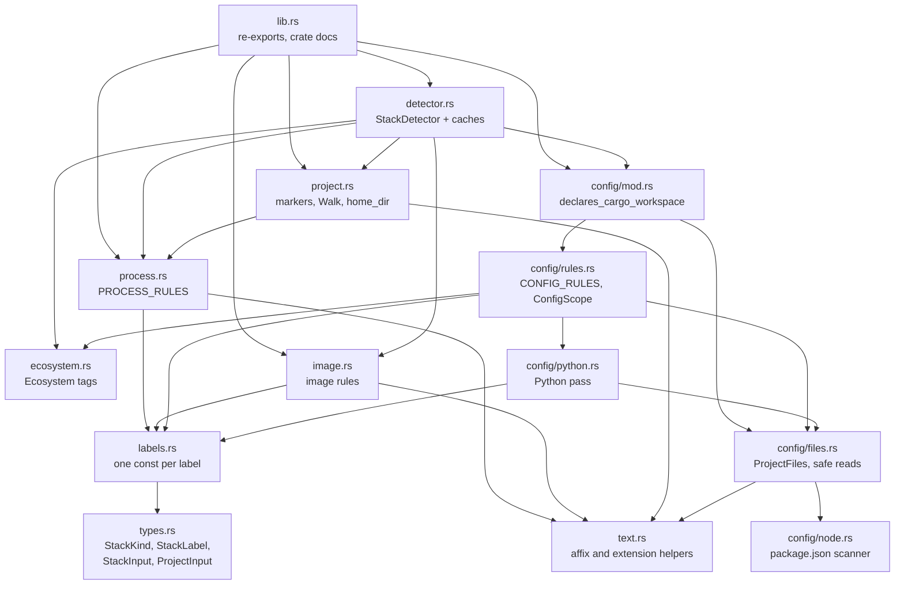
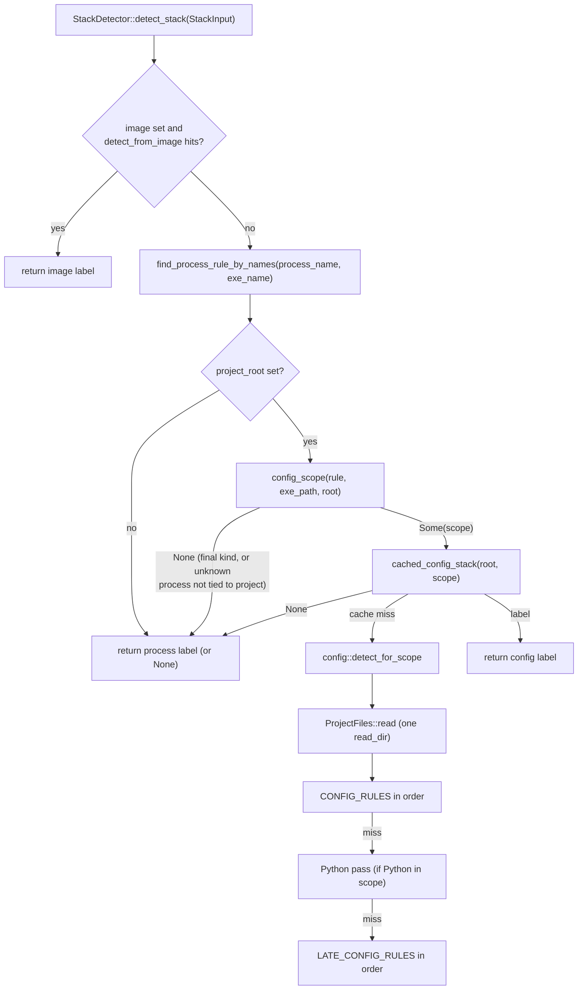
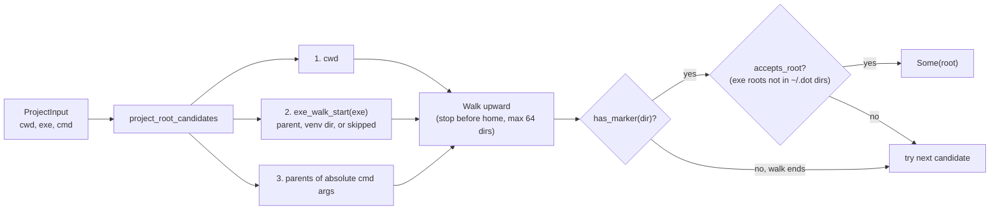

# what-stack Architecture

This document explains how the `what-stack` crate is built: what it does, how a call flows through it, how each module works, and where to make changes. It is written for a developer who is new to the codebase. Paths are relative to the repository root. Names in backticks are real identifiers you can grep for.

Contents:

1. [What what-stack is](#1-what-what-stack-is)
2. [Big picture](#2-big-picture)
3. [Public API surface](#3-public-api-surface)
4. [Module by module](#4-module-by-module)
5. [The detection model in depth](#5-the-detection-model-in-depth)
6. [Worked examples](#6-worked-examples)
7. [Filesystem access, caching, performance, safety, platforms](#7-filesystem-access-caching-performance-safety-platforms)
8. [Testing strategy and benchmarks](#8-testing-strategy-and-benchmarks)
9. [Design decisions, invariants, and how to add a stack](#9-design-decisions-invariants-and-how-to-add-a-stack)
10. [Sharp edges and known limitations](#10-sharp-edges-and-known-limitations)

---

## 1. What what-stack is

`what-stack` answers two questions about a running process or a directory:

- **Where is the project?** Walk upward from a working directory, an executable path, or absolute command-line arguments until a project marker file (`package.json`, `Cargo.toml`, `go.mod`, `*.csproj`, ...) is found.
- **What stack is it?** Produce a human-readable `StackLabel` such as `Next.js`, `Django`, `PostgreSQL`, or `Nginx`, each tagged with a `StackKind` (runtime, framework, tool, database, or service).

Evidence comes from four sources, all supplied by the caller as plain strings and paths: a container or artifact **image name**, a **process name** (plus executable name and path), the **files in a project root**, and the **paths used to find that root**. The crate never discovers processes, sockets, or containers itself.

A note on naming: in this crate "label" always means a `StackLabel` (the output), defined in `src/labels.rs`. The crate does not read container labels, Dockerfiles, or image manifests.

### Design goals

These come from `README.md`, the crate docs in `src/lib.rs`, and the code itself:

- **Standalone and dependency-light.** No async runtime, regex engine, JSON parser, logging facade, serde model, CLI types, or subprocesses. The only runtime dependency is `libc`, and only on Unix (for home-directory lookup). Windows has zero runtime dependencies.
- **Explicit evidence over guesses.** Labels come from names and files that actually identify a technology. There is no well-known-port fallback.
- **Exact by default, with narrow, documented relaxations.** `node` is Node.js but `node-exporter` is nothing; `postgres-exporter` is not PostgreSQL.
- **Context-aware, not greedy.** A project's config refines a generic runtime (`node` in a Next.js folder is `Next.js`) but never overrides a specific service (`postgres` in that folder stays `PostgreSQL`), and only within the runtime's own language ecosystem.
- **Best-effort and infallible.** No function returns `Result`. Unreadable directories, missing files, and malformed content simply produce no label or no root. Property tests check that nothing panics on arbitrary input.
- **Cheap on the hot path.** Built-in labels borrow `&'static str` and never allocate. String rules are linear scans with ASCII case-insensitive comparison, no lowercase copies. Filesystem work is cached per scan in `StackDetector`.
- **Safe filesystem reads.** Reads are capped at 64 KiB, limited to regular files, non-blocking on Unix (a FIFO named `app.py` cannot hang the caller), and tolerant of UTF-16 and invalid UTF-8.

### Explicit non-goals

From the `# Scope` section of `src/lib.rs`: the crate does not discover running processes, inspect network ports, query container engines, kill processes, read custom rule files, or format user-facing output. Rules are built in and compiled into the binary.

---

## 2. Big picture

### Module map



Leaf modules (`types`, `labels`, `ecosystem`, `text`) hold data and tiny helpers. The three rule modules (`process`, `image`, `config`) are independent of each other. `project` uses `process` for one thing: deciding whether an executable is a known runtime. `detector` is the only module that combines everything and the only one with state.

### The `detect_stack` pipeline



### The `detect_project_root` pipeline



The first candidate that yields an accepted root wins. `resolve_project_root` runs this uncached; `StackDetector::detect_project_root` runs it with a per-directory cache.

### Boundary: how portlens uses it

PortLens (`d:\crate\portlens`) depends on `what-stack` for project and app detection and keeps everything else (sockets, Docker, killing) on its side. Per scan, its collector creates one `StackDetector::with_home(home)`, where `home` is `what_stack::home_dir()` with deep enrichment on and `None` otherwise. With deep enrichment on, for a socket owned by a host process it calls `detect_project_root` with the process `cwd`, `exe`, and `cmd`, and `project_name` for the display name; containerized sockets use the container name instead and pass no root. With deep enrichment on, it also calls `detect_stack` with the container image, project root, executable name, and executable path; otherwise it calls `detect_from_process_names`. It keeps only the text via `StackLabel::into_cow`, discarding the kind. That is the whole contract; nothing in this crate knows about PortLens.

---

## 3. Public API surface

Everything public is re-exported from `src/lib.rs`. Internal modules are private.

| Item | Defined in | Contract |
| ---- | ---------- | -------- |
| `StackLabel` | `src/types.rs` | Display text (`Cow<'static, str>`) plus a `StackKind`. `as_str`, `kind`, `Display`, `AsRef<str>`, `into_cow`, `From<StackLabel>` for `String` and `Cow`. `new` (owned or static text) and `const fn from_static`. |
| `StackKind` | `src/types.rs` | `Runtime`, `Framework`, `Tool`, `Database`, `Service`. `#[non_exhaustive]`. Decides whether config may replace a process label. |
| `StackInput<'a>` | `src/types.rs` | Builder for `detect_stack`: `new(process_name)`, `.image()`, `.project_root()`, `.exe_name()`, `.exe_path()`. Setters take a value or an `Option`. `Copy`, `#[non_exhaustive]`, fields are `pub(crate)`. |
| `ProjectInput<'a>` | `src/types.rs` | Builder for root resolution: `new()`, `.cwd()`, `.exe()`, `.cmd(&[OsString])`. Same builder conventions, except that `cmd` takes a slice rather than an `Option`. |
| `StackDetector` | `src/detector.rs` | Stateful, cache-owning detector. `new()` / `Default` (home ceiling from `home_dir()`), `with_home(Option<PathBuf>)`, `home()`, `clear()`, `detect_project_root(ProjectInput)`, `detect_stack(StackInput)`. Methods that touch caches take `&mut self`. |
| `detect_from_image(&str)` | `src/image.rs` | Pure string match on the image base name. No I/O. |
| `detect_from_process(&str)` | `src/process.rs` | Pure string match on a process name. No I/O. |
| `detect_from_process_names(&str, Option<&str>)` | `src/process.rs` | Process name, then executable name as a fallback. No I/O. |
| `detect_from_config(&Path)` | `src/config/rules.rs` | Scans one directory with every rule in fixed order (`ConfigScope::All`). Uncached. |
| `find_project_root(&Path, Option<&Path>)` | `src/project.rs` | One upward marker walk with an optional home ceiling. Uncached. |
| `resolve_project_root(ProjectInput, Option<&Path>)` | `src/project.rs` | The cwd, exe, cmd fallback order. Uncached. |
| `project_name(&Path)` | `src/project.rs` | Final path component, lossily converted. Reads nothing. |
| `home_dir()` | `src/project.rs` | Current user's home (sudo-aware on Unix, `USERPROFILE` on Windows, `None` elsewhere). |
| `MAX_WALK_DEPTH` | `src/project.rs` | `64`: maximum directories tested per upward walk, start included. |

### Contracts worth knowing before you call anything

- **All results are `Option`.** `None` means "no evidence", never "error". I/O errors are swallowed.
- **Label equality.** `StackLabel == StackLabel` compares text and kind; `StackLabel == "text"` (and the reverse) compares text only. Hashing uses both. A test in `src/lib.rs` pins this.
- **Built-in labels never allocate.** Every rule table holds `labels::*` constants made with `from_static`, so `into_cow()` on a detected label is always `Cow::Borrowed`. Tests assert this.
- **`detect_stack` needs a reason to read config.** If the process is unknown and `exe_path` is not given (or does not tie the executable to the project), config is not consulted and the result is `None` even when `project_root` holds a Next.js app. Use `detect_from_config` when you want a label from files alone.
- **`StackInput::project_root` is scanned as given.** `detect_stack` does not walk up or down from it. Resolve the root first with `detect_project_root`.
- **Cache lifetime is the detector's lifetime.** There is no TTL. Call `clear()` between scans when filesystem changes should be observed; it keeps the home ceiling.
- **Inputs are never mutated or canonicalized.** Paths are compared as given (component-wise, case-insensitively on Windows).

---

## 4. Module by module

### `src/lib.rs`

**Responsibility:** crate-level documentation (the detection model and scope), module declarations, and public re-exports. It also compiles `README.md` as doctests through the `#[cfg(doctest)] ReadmeDoctests` struct, so README examples cannot rot.

**Tests here:** cross-rule invariants that need access to private modules: `every_label_text_has_exactly_one_kind_across_all_rules` (scans `labels::ALL`), `stack_label_text_traits_ignore_kind_but_equality_does_not`, and `builtin_labels_borrow_static_text`.

### `src/types.rs`

**Responsibility:** the four public data types. No logic beyond constructors, accessors, and trait impls.

- `StackKind`: the doc comment states the core policy, which `detector.rs` implements: `Runtime` and `Tool` are generic hosts that config may refine; `Framework`, `Database`, and `Service` are final.
- `StackLabel { text: Cow<'static, str>, kind: StackKind }`: `from_static` is `const`, which is what lets `labels.rs` define labels as `const` items.
- `ProjectInput { cwd, exe, cmd }` and `StackInput { image, project_root, process_name, exe_name, exe_path }`: borrowed, `Copy`, `#[non_exhaustive]` with `pub(crate)` fields, so callers must use the builders and new fields can be added without a breaking change. Setters use `impl Into<Option<&T>>` so both `x` and `Some(x)`/`None` work (the one exception is `ProjectInput::cmd`, a `const fn` that takes `&[OsString]`).

**Does not:** validate paths, normalize text, or allocate.

### `src/labels.rs`

**Responsibility:** the single source of truth for every built-in label. A `labels!` macro turns lines like `NEXT_JS = Framework("Next.js");` into `pub const NEXT_JS: StackLabel` and, under `#[cfg(test)]`, collects them into `ALL`.

Because process, image, and config rules all reference these constants, a label's text and kind are defined once and cannot drift between tables.

| Kind | Labels |
| ---- | ------ |
| Runtime | Node.js, Deno, Bun, Python, Gunicorn, Uvicorn, Ruby, Puma, PHP, Java, .NET, .NET (F#), Go, Rust, Erlang, Elixir, Perl, Dart, Swift |
| Framework | Next.js, Nuxt, Angular, SvelteKit, Astro, Remix, Gatsby, React Router, NestJS, Express, Hugo, Jekyll, Django, Flask, FastAPI, Starlette, Litestar, Rails, Ruby (Rack), Laravel, Phoenix, Spring Boot, Symfony |
| Tool | Vite, Webpack, Vue CLI, Java (Maven), Java (Gradle), Kotlin (Gradle) |
| Database | PostgreSQL, MySQL, MariaDB, MongoDB, Redis, Valkey, Memcached, ClickHouse, CockroachDB, SQL Server, Elasticsearch, OpenSearch |
| Service | Nginx, Apache, Caddy, Traefik, Envoy, HAProxy, IIS, RabbitMQ, Kafka, LocalStack |

Note that application servers (`Gunicorn`, `Uvicorn`, `Puma`) are `Runtime`, deliberately: they host project code, so a framework label from config may replace them.

### `src/ecosystem.rs`

**Responsibility:** the internal `Ecosystem` enum (`Node`, `Deno`, `Python`, `Ruby`, `Php`, `Jvm`, `DotNet`, `Rust`, `Go`, `Beam`, `Other`). Every process rule and every config rule carries one.

- `accepts_config(self, rule)`: a process of ecosystem `self` may take a config label from ecosystem `rule` when they are equal, or when the process is `Deno` and the rule is `Node` (Deno runs Node projects; the reverse is not true).
- `is_compiled(self)`: `Rust`, `Go`, `DotNet`, `Jvm`. Used to prefer compiled-ecosystem config for unknown binaries inside a project.

`Other` covers services, databases, and labels without config rules (the `Perl`, `Dart`, and `Swift` runtimes and the `Hugo` framework). A runtime tagged `Other` effectively never gets a config label, because no config rule is tagged `Other`.

### `src/text.rs`

**Responsibility:** three allocation-free helpers: `strip_prefix_ignore_ascii_case`, `strip_suffix_ignore_ascii_case` (both safe on non-ASCII char boundaries, returning `None` instead of panicking), and `file_extension` (uses `Path::extension` rules, so `.bashrc` has no extension).

### `src/process.rs`

**Responsibility:** map a process or executable name to a label and an ecosystem.

**Key items:**

- `ProcessRule = (&'static [&'static str], StackLabel, Ecosystem)`: all names for one label, the label, and its ecosystem.
- `PROCESS_RULES`: one row per label, scanned linearly. First matching row wins.
- `TITLED_PROCESSES = ["next-server", "puma", "gunicorn"]`.
- Public: `detect_from_process`, `detect_from_process_names`. Crate-internal: `find_process_rule_by_names` (returns the whole rule, which `detector.rs` and `project.rs` need for the ecosystem and kind).

**How a name is matched** (`find_process_rule`):

1. Strip a trailing `.exe`, ignoring case (on every platform).
2. `find_exact`: ASCII case-insensitive equality with any name in any row.
3. `find_titled`: split at the first space or colon; if the head is in `TITLED_PROCESSES`, match the head exactly. This covers Linux process titles truncated to 15 characters: `next-server (v1`, `puma 6.4.2 (tc`, `gunicorn: maste`.
4. `find_versioned_runtime`: trim trailing digits and dots; if what was trimmed starts with a digit and the base matches exactly a rule whose label is `Runtime`, use it. So `python3.12`, `php-fpm8.2`, `node20` match, but `mysql8` (a `Database`) does not.

`find_process_rule_by_names` tries the process name first and the executable name only when the process name is unknown.

**Process rules by ecosystem:**

| Ecosystem | Names and labels |
| --------- | ---------------- |
| Node | `node`/`nodejs` Node.js, `bun` Bun, `webpack` Webpack, `vite` Vite, `next-server` Next.js, `nuxt` Nuxt |
| Deno | `deno` Deno |
| Python | `python`/`python3`/`pythonw` Python, `gunicorn` Gunicorn, `uvicorn` Uvicorn, `flask` Flask |
| Ruby | `ruby` Ruby, `puma` Puma, `jekyll` Jekyll, `rails` Rails |
| Php | `php`/`php-fpm` PHP |
| Jvm | `java`/`javaw` Java, `gradle` Java (Gradle), `mvn` Java (Maven) |
| DotNet | `dotnet` .NET |
| Rust | `cargo`/`rustc` Rust |
| Go | `go` Go |
| Beam | `erlang`/`beam.smp`/`erl`/`werl` Erlang, `elixir` Elixir |
| Other | `perl`, `dart`, `swift`, `hugo`; databases (`postgres`, `postgresql`, `mysqld`, `mysql`, `mariadbd`, `mariadb`, `mongod`, `mongos`, `redis-server`, `redis`, `valkey-server`, `valkey`, `memcached`, `clickhouse-server`, `cockroach`, `sqlservr`, `elasticsearch`, `opensearch`); services (`nginx`, `apache2`, `httpd`, `caddy`, `traefik`, `envoy`, `haproxy`, `w3wp` IIS, `rabbitmq-server`, `kafka`) |

**Does not:** look at command-line arguments, guess from substrings (`node-exporter` is unknown), or read files.

### `src/image.rs`

**Responsibility:** map a container or artifact image reference to a label. Pure string parsing; it never contacts a registry or daemon.

**How it works** (`detect_from_image`):

1. Take the last `/` segment and cut it at the first `:` or `@`, removing registry, namespace, tag, and digest: `ghcr.io/org/nginx:latest` becomes `nginx`.
2. `detect_exact_base` against `EXACT_IMAGE_RULES`: language runtime images that must match exactly (`node`, `python`, `python3`, `ruby`, `golang`, `go`, `rust`, `bun`, `deno`, `php`, `elixir`) plus `mongo` and `httpd`. So `python-linter` is nothing.
3. `detect_prefixed_base` against `PREFIX_IMAGE_RULES` (databases, services, and the `openjdk`, `eclipse-temurin`, `amazoncorretto`, `dotnet` runtime images). `matches_service_prefix` requires the base to equal the prefix or continue with a separator (`-`, `_`, `.`), so `postgrest` and `redisinsight` do not match. After the separator, if any remaining segment is in `COMPANION_SEGMENTS` (`exporter`, `dashboard(s)`, `operator`, `admin`, `ui`, `gui`, `backup`, `client`, `cli`, `commander`, `workbench`, `shell`, `curator`, `auth`, `connect`), the match is rejected: `postgres-exporter`, `opensearch-dashboards`, `cp-kafka-connect` get no label. `proxy` is intentionally not a companion, because `nginx-proxy` runs Nginx.
4. `detect_namespace` against `NAMESPACE_IMAGE_RULES` (`dotnet` .NET, `mssql` SQL Server) on every segment before the last: `mcr.microsoft.com/dotnet/aspnet`, `mcr.microsoft.com/mssql/server`.

All comparisons are ASCII case-insensitive.

**Does not:** inspect image manifests, labels, or layers; read custom rules; or apply the companion filter to exact or namespace rules.

### `src/project.rs`

**Responsibility:** project-root discovery and platform path helpers.

**Key items:**

- `PROJECT_MARKERS` (exact file names: `package.json`, `Cargo.toml`, `go.mod`, `go.work`, `pyproject.toml`, `requirements.txt`, `setup.py`, `Pipfile`, `pom.xml`, `build.gradle`, `build.gradle.kts`, `settings.gradle`, `settings.gradle.kts`, `composer.json`, `Gemfile`, `mix.exs`, `deno.json`, `deno.jsonc`, `bun.lockb`, `bun.lock`) and `PROJECT_MARKER_EXTENSIONS` (`csproj`, `fsproj`, `sln`, `slnx`). `has_marker(dir)` lists `dir` once and checks every entry name against both.
- `Walk<'a>`: the upward iterator used everywhere. It yields `start` and its ancestors, nearest first, and stops (a) before yielding a directory equal to `home`, (b) after yielding the filesystem root, or (c) after `MAX_WALK_DEPTH` directories, recording `hit_depth_cap()` in that last case only when untested ancestors remain. Relative starts are walked lexically: one that begins with a plain name ends at `.` (so `src` tests `src`, then `.`), while one that begins with `.` or `..` ends at that prefix (`../x` tests `../x`, then `..`). An empty start yields nothing.
- `find_project_root(start, home)`: the first `Walk` directory with a marker.
- `project_root_candidates(input)`: the ordered `(start, from_exe)` list: `cwd`, then `exe_walk_start(exe)`, then parents of absolute `cmd` arguments (relative arguments are ignored because they cannot be resolved safely).
- `exe_walk_start(exe)`: returns the executable's parent for unknown executables and for known executables of a final kind (a `postgres` or `nginx` binary still walks from its parent). For a known `Runtime` or `Tool` executable (looked up with `find_process_rule_by_names` on the file name) it returns `None`, because walking up from `~/.nvm/versions/node/v20/bin` finds the install tree, not the project. Exception: `virtual_env_dir` checks the parent and grandparent for `pyvenv.cfg`; if found, the walk starts at that environment directory, so `app/.venv/bin/python` finds `app` and an in-place venv finds itself. Conda environments have no `pyvenv.cfg` and are skipped.
- `accepts_root(root, from_exe, home)`: rejects a root found from the executable when it lies at or below a dot directory directly under `home` (`~/.nvm`, `~/.cargo`, `~/.local`, `~/.virtualenvs`).
- `resolve_project_root(input, home)`: `project_root_candidates` plus `find_project_root` plus `accepts_root`, first hit wins.
- `paths_equal` and `path_starts_with`: whole-component comparisons, ASCII case-insensitive on Windows, exact elsewhere. Used for the home ceiling, "is the executable inside the project", and dot-dir checks.
- `home_dir()`: Unix prefers a `getpwuid_r` lookup for the effective uid, or for `SUDO_UID` when running as root; then `SUDO_HOME` (root only, non-empty); then `HOME`. Windows reads `USERPROFILE`. Other targets return `None`. This is the only `unsafe` code in the library outside tests (the Unix FIFO test in `src/config/files.rs` also calls `libc::mkfifo`), each block with a `// Safety:` comment.

**Does not:** cache (that is `detector.rs`), canonicalize or resolve symlinks, read file contents, or search child directories.

### `src/detector.rs`

**Responsibility:** `StackDetector`, the stateful entry point that combines everything and caches filesystem results.

**State:**

```rust
pub struct StackDetector {
    home: Option<PathBuf>,
    project_cache: HashMap<PathBuf, Option<PathBuf>>,           // visited dir -> root (or miss)
    config_cache: HashMap<PathBuf, Vec<(ConfigScope, Option<StackLabel>)>>, // root -> per-scope result
}
```

**Key functions:**

- `detect_project_root`: iterates `project_root_candidates`, resolves each start with `cached_project_root`, and filters with `accepts_root` (the cache stores raw roots; acceptance is checked per call because it depends on `from_exe`).
- `cached_project_root(start)`: walks with `Walk`; at each directory, a cache hit ends the walk with the cached answer; otherwise the directory is recorded as visited and tested with `has_marker`. Afterwards every visited directory is cached with the result (hit or miss). One exception: a miss caused by the depth cap is not cached, since a walk from a shallower visited directory could still reach a root. Ancestors above a discovered root are never visited, so they are never cached as hits.
- `detect_stack`: the priority pipeline (section 5.4).
- `config_scope(rule, exe_path, root)`: chooses which config rules may apply, or `None` (section 5.5).
- `cached_config_stack(root, scope)`: caches `detect_for_scope` results per `(root, scope)` pair.
- Helpers: `accepts_config_override(kind)` (only `Runtime` and `Tool`; every other kind, including future ones, is final), `is_in_node_modules` (a `node_modules` component below the root, compared ignoring ASCII case on every platform), `is_go_build_binary` (a path component `go-build` followed by at least one digit and only digits), and `is_cargo_workspace_binary` (walks up from the root, skipping the root itself, looking for an ancestor whose `target` directory contains the executable and whose `Cargo.toml` declares `[workspace]`).

**Does not:** decide anything about images or process names itself (it delegates), or expire caches on its own.

### `src/config/mod.rs`

**Responsibility:** the config submodule's front door. It re-exports `ConfigScope`, `detect_for_scope`, and `detect_from_config` from `rules.rs`, and defines `declares_cargo_workspace(dir)`, which reads `dir/Cargo.toml` (capped, safe read) and looks for a line starting with `[workspace]` or `[workspace.` after leading whitespace.

### `src/config/rules.rs`

**Responsibility:** the ordered config rule tables and the scoped matching engine. This is the heart of project-file detection and is described in full in sections 5.5 and 5.6.

**Key items:**

- `ConfigMatch`: how a rule recognizes files. `Exact(name)`, `Prefix(prefix)` (name plus a common config suffix), `AllOf(paths)` (every path exists; nested paths like `bin/rails` use `/`), `Extension(ext)`, `NodeDependency(pkgs)` (`dependencies` or `devDependencies`), `NodeRuntimeDependency(pkgs)` (`dependencies` only), `PrefixWithNodeDependency(prefix, pkgs)`, and `FileToken(file, token)` (the file mentions the token outside comments).
- `ConfigRule = (ConfigMatch, StackLabel, Ecosystem)`.
- `CONFIG_RULES` (checked before the Python pass) and `LATE_CONFIG_RULES` (checked after it).
- `ConfigScope`: `All`, `CompiledFirst`, `NodeFirst`, `Ecosystem(E)`.
- `detect_for_scope` reads the directory once into `ProjectFiles` and runs `detect_with` one or two times depending on the scope. `detect_with` runs `CONFIG_RULES`, then the Python pass if `Python` is in scope, then `LATE_CONFIG_RULES`, all filtered by the scope predicate. `rule_matches` dispatches each `ConfigMatch` variant to a `ProjectFiles` method.

**Does not:** walk parents, recurse into children (except the fixed nested paths in `AllOf` rules), or know about processes beyond the scope it is handed.

### `src/config/files.rs`

**Responsibility:** `ProjectFiles`, an in-memory view of one project root, and every safe file read in the crate.

- `ProjectFiles::read(root)`: one `read_dir`; stores entry names (files and directories alike; non-UTF-8 names are skipped) in a `HashSet<String>`. Returns `None` if the directory cannot be listed.
- Name queries over the listing: `contains_exact`, `any_exact`, `contains_prefix` (prefix plus one of `""`, `.js`, `.cjs`, `.mjs`, `.ts`, `.cts`, `.mts`), `contains_extension`, and `contains_path` (plain names use the listing; names with `/` are checked with `is_file()`).
- `node_dependencies(root)`: parses `package.json` lazily, at most once per `ProjectFiles`, via a `OnceCell`.
- `mentions_token(root, file, token)`: removes `<!-- -->` spans (unterminated comments run to the end), skips lines starting with `#`, `//`, `/*`, or `*`, and requires the token to be followed by a non-identifier character, so `:phoenix` does not match `:phoenix_pubsub`.
- `read_text` (first 64 KiB of a listed file) and `read_complete_text` (`None` if the file is longer than 64 KiB, for lock files that must be read whole).
- `read_text_file(path)`: the shared safe reader, also used by `declares_cargo_workspace`.
- `read_regular_file_prefix`: on non-Windows, checks `metadata().is_file()` before opening; opens with `O_NONBLOCK` on Unix; re-checks the opened handle's metadata (closing the swap race); reads at most `MAX_SCAN_BYTES` (64 KiB) and reports whether that was the whole file.
- `decode_text`: UTF-16 LE or BE when a byte-order mark is present, otherwise UTF-8 with invalid sequences replaced by U+FFFD. Never fails.

### `src/config/node.rs`

**Responsibility:** extract dependency names from `package.json` without a JSON library.

`dependency_names(json) -> NodeDependencies { runtime, dev }` walks the top-level object key by key. For `"dependencies"` and `"devDependencies"` whose value is an object, `collect_object_keys` records the keys; every other value is skipped whole by `skip_value`, which tracks string state, escapes, and bracket depth. Consequences:

- The same keys nested deeper (`pnpm.packageExtensions`, `overrides`, `workspaces`) or inside strings do not count.
- A leading UTF-8 BOM and whitespace are skipped.
- Malformed or truncated input stops the scan and returns the names read so far. Combined with the 64 KiB cap, dependencies after the cap are not seen.
- Keys are returned raw (escape sequences are not decoded).

`has_any` checks both maps; `has_runtime` checks only `dependencies`. A proptest in this file generates random JSON documents and checks that the scanner returns exactly the top-level dependency names.

### `src/config/python.rs`

**Responsibility:** decide whether a root is a Python project and which framework it uses. Called from `detect_with` only when the Python ecosystem is in scope. Full algorithm in section 5.7.

**Key items:** `PYTHON_ENTRY_FILES`, `PYTHON_MANIFEST_FILES`, `PYTHON_LOCK_FILES`, `DJANGO_SOURCE_PATTERNS`, `PYTHON_SOURCE_PATTERNS`, `PYTHON_DEPENDENCY_PATTERNS`, and `detect_python_project(root, files, python_process)`.

**Does not:** parse TOML or requirement specifiers, follow `-r` includes, or look below the root (an `app/main.py` is not an entry file; the framework must then come from a manifest).

---

## 5. The detection model in depth

### 5.1 Evidence sources

| Source | API | Reads disk | What it can identify |
| ------ | --- | ---------- | -------------------- |
| Image name | `detect_from_image` | No | Databases, services, language runtime images |
| Process name, exe name | `detect_from_process`, `detect_from_process_names` | No | Runtimes, app servers, databases, services, a few tools and frameworks |
| Project files | `detect_from_config`, `StackDetector::detect_stack` | Yes, one directory | Frameworks, build tools, language toolchains |
| Exe path location | `StackDetector::detect_stack` (`exe_path`) | Only for the Cargo workspace check | Whether an unknown binary belongs to the project, and which ecosystem built it |
| Paths for the root | `find_project_root`, `resolve_project_root`, `detect_project_root` | Yes, directory listings | The project root (not a label) |

### 5.2 Kinds decide finality

The kind is attached where a label is defined (`src/labels.rs`). `detector.rs` reads it through `accepts_config_override`:

| Kind | Config may replace it? | Examples |
| ---- | ---------------------- | -------- |
| Runtime | Yes, within its ecosystem | `node`, `python3.12`, `gunicorn`, `java`, `beam.smp` |
| Tool | Yes, within its ecosystem | `vite`, `webpack`, `mvn`, `gradle` |
| Framework | No (final) | `next-server`, `rails`, `flask`, `hugo` |
| Database | No (final) | `postgres`, `redis-server` |
| Service | No (final) | `nginx`, `traefik`, `w3wp` |
| Future kinds | No (final) | `StackKind` is `#[non_exhaustive]`; the `matches!` treats anything new as final |

### 5.3 Ecosystems decide which config applies

A known process accepts only config rules whose ecosystem it accepts (`Ecosystem::accepts_config`):

| Process ecosystem | Accepts config from | Config rules available |
| ----------------- | ------------------- | ---------------------- |
| Node (`node`, `bun`, `vite`, `webpack`) | Node | Next.js, Nuxt, Angular, SvelteKit, Astro, React Router, Remix, NestJS, Vite, Gatsby, Vue CLI, Webpack, Express |
| Deno (`deno`) | Deno and Node | Node and Deno rules in table order: Node framework and bundler configs beat `deno.json`/`deno.jsonc`, which beat Express |
| Python (`python`, `gunicorn`, `uvicorn`) | Python | Python pass only, frameworks only (no generic `Python`) |
| Ruby (`ruby`, `puma`) | Ruby | Rails, Ruby (Rack) |
| Php (`php`, `php-fpm`) | Php | Laravel, Symfony, PHP |
| Jvm (`java`, `mvn`, `gradle`) | Jvm | Spring Boot, Java (Maven), Kotlin (Gradle), Java (Gradle) |
| DotNet (`dotnet`) | DotNet | .NET, .NET (F#) |
| Rust (`cargo`, `rustc`) | Rust | Rust |
| Go (`go`) | Go | Go |
| Beam (`erl`, `beam.smp`, `elixir`) | Beam | Phoenix, Elixir |
| Other (`perl`, `dart`, `swift`) | Other | None, so the process label stands |

Unknown processes do not have an ecosystem; their scope comes from where their executable lives (section 5.5).

### 5.4 `detect_stack` decision procedure

```text
1. if image is set and detect_from_image(image) is Some(label): return label
2. rule = find_process_rule_by_names(process_name, exe_name)
3. if project_root is set:
       scope = config_scope(rule, exe_path, project_root)
       if scope is Some and cached_config_stack(project_root, scope) is Some(label):
           return label
4. return rule's label, or None
```

The documented four-level priority (image; final process label; config; runtime or tool process label) falls out of this: `config_scope` returns `None` for a final kind, so step 3 is skipped and step 4 returns the final label. An unknown image does not stop the pipeline; it falls through to the process.

### 5.5 Config scopes (`config_scope` and `ConfigScope`)

| Situation | Scope | Rules tried |
| --------- | ----- | ----------- |
| Known process, kind `Runtime` or `Tool` | `Ecosystem(e)` | Only rules accepted by `e`, in table order. Python processes get the frameworks-only Python pass. |
| Known process, final kind | none | Config is not used. |
| Unknown process, no `exe_path` | none | Config is not used. |
| Unknown process, exe inside the root and under a `node_modules` component below the root | `NodeFirst` | Node rules first, then every rule in order. |
| Unknown process, exe inside the root otherwise | `CompiledFirst` | Rust, Go, .NET, JVM rules first, then every rule in order. |
| Unknown process, exe under a `go-build<digits>` directory | `Ecosystem(Go)` | Go rules only. |
| Unknown process, exe under `<ancestor>/target` where `<ancestor>/Cargo.toml` declares a workspace | `Ecosystem(Rust)` | Rust rules only. |
| Unknown process, exe elsewhere | none | Config is not used. |
| `detect_from_config` (no process) | `All` | Every rule in order. |

The two-pass scopes (`CompiledFirst`, `NodeFirst`) reuse the same `ProjectFiles`, so the second pass does not list the directory again.

### 5.6 The config rule table, in order

There is no scoring and no confidence value. Rules are tried in this order and the **first match wins**. An `Ecosystem` scope only removes rows; the two-pass scopes (`CompiledFirst`, `NodeFirst`) first try a subset in table order and then the whole table. Position in the table is the entire precedence model.

| # | Matcher | Label (kind) | Ecosystem |
| - | ------- | ------------ | --------- |
| 1 | `Prefix("next.config")` | Next.js (Framework) | Node |
| 2 | `Prefix("nuxt.config")` | Nuxt (Framework) | Node |
| 3 | `Exact("angular.json")` | Angular (Framework) | Node |
| 4 | `PrefixWithNodeDependency("svelte.config", ["@sveltejs/kit"])` | SvelteKit (Framework) | Node |
| 5 | `Prefix("astro.config")` | Astro (Framework) | Node |
| 6 | `Prefix("react-router.config")` | React Router (Framework) | Node |
| 7 | `Prefix("remix.config")` | Remix (Framework) | Node |
| 8 | `NodeDependency(REMIX_PACKAGES)` (`@remix-run/dev`, `@remix-run/react`, `@remix-run/node`, `@remix-run/serve`, `@remix-run/cloudflare`) | Remix (Framework) | Node |
| 9 | `Exact("nest-cli.json")` | NestJS (Framework) | Node |
| 10 | `NodeDependency(["@nestjs/core"])` | NestJS (Framework) | Node |
| 11 | `NodeDependency(["next"])` | Next.js (Framework) | Node |
| 12 | `Prefix("vite.config")` | Vite (Tool) | Node |
| 13 | `Prefix("gatsby-config")` | Gatsby (Framework) | Node |
| 14 | `Prefix("vue.config")` | Vue CLI (Tool) | Node |
| 15 | `Prefix("webpack.config")` | Webpack (Tool) | Node |
| 16 | `Exact("Cargo.toml")` | Rust (Runtime) | Rust |
| 17 | `Exact("go.mod")` | Go (Runtime) | Go |
| 18 | `Exact("go.work")` | Go (Runtime) | Go |
| 19 | `FileToken("pom.xml", "org.springframework.boot")` | Spring Boot (Framework) | Jvm |
| 20 | `FileToken("build.gradle.kts", "org.springframework.boot")` | Spring Boot (Framework) | Jvm |
| 21 | `FileToken("build.gradle", "org.springframework.boot")` | Spring Boot (Framework) | Jvm |
| 22 | `Exact("pom.xml")` | Java (Maven) (Tool) | Jvm |
| 23 | `Exact("build.gradle.kts")` | Kotlin (Gradle) (Tool) | Jvm |
| 24 | `Exact("build.gradle")` | Java (Gradle) (Tool) | Jvm |
| 25 | `Exact("settings.gradle.kts")` | Kotlin (Gradle) (Tool) | Jvm |
| 26 | `Exact("settings.gradle")` | Java (Gradle) (Tool) | Jvm |
| 27 | `AllOf(["artisan", "composer.json"])` | Laravel (Framework) | Php |
| 28 | `AllOf(["composer.json", "symfony.lock"])` | Symfony (Framework) | Php |
| 29 | `AllOf(["composer.json", "bin/console"])` | Symfony (Framework) | Php |
| 30 | `Exact("composer.json")` | PHP (Runtime) | Php |
| 31 | `FileToken("mix.exs", ":phoenix")` | Phoenix (Framework) | Beam |
| 32 | `Exact("mix.exs")` | Elixir (Runtime) | Beam |
| 33 | `Exact("deno.json")` | Deno (Runtime) | Deno |
| 34 | `Exact("deno.jsonc")` | Deno (Runtime) | Deno |
| P | Python pass (`detect_python_project`) | Django, FastAPI, Starlette, Litestar, Flask, or Python | Python |
| L1 | `AllOf(["Gemfile", "config.ru", "bin/rails"])` | Rails (Framework) | Ruby |
| L2 | `AllOf(["Gemfile", "config.ru"])` | Ruby (Rack) (Framework) | Ruby |
| L3 | `Extension("csproj")` | .NET (Runtime) | DotNet |
| L4 | `Extension("fsproj")` | .NET (F#) (Runtime) | DotNet |
| L5 | `Extension("sln")` | .NET (Runtime) | DotNet |
| L6 | `Extension("slnx")` | .NET (Runtime) | DotNet |
| L7 | `NodeRuntimeDependency(["express"])` | Express (Framework) | Node |

The ordering encodes these deliberate choices (most are commented in the source):

- **Specific beats generic.** Framework configs come before bundler configs (`vite.config` is row 12; the one exception is `gatsby-config` at row 13, which builds with webpack rather than Vite), and bundler configs come before language toolchain markers. In `All` scope, frontend config wins over a backend toolchain in the same root: a Laravel root with `vite.config.js` is `Vite` from `detect_from_config`. The ecosystem scope is what gives `php` the `Laravel` label there.
- **Vite-based frameworks before Vite.** React Router v7 and Remix build with Vite, so rows 6 to 8 precede row 12. `svelte.config` alone is not SvelteKit (plain Svelte with Vite also has it), hence the dependency check in row 4.
- **Next.js 13+ needs no config file**, so row 11 checks the `next` dependency.
- **Spring Boot before plain Maven or Gradle**, and build scripts before `settings.gradle*` (which only marks a multi-module root without its own script).
- **Laravel and Symfony before plain PHP**, Phoenix before plain Elixir.
- **Express is the weakest signal** and is last of all, after the Python pass and after .NET, so a repo with `package.json` listing `express` beside `Cargo.toml`, `go.mod`, or a `.csproj` keeps that build's label. It also requires `dependencies`, not `devDependencies`, because a library with an Express test server is not an Express app.
- `@remix-run/router` is excluded from `REMIX_PACKAGES` because it is React Router 6's core and appears in plain React apps.

**There is no config rule for plain Node.js or plain Ruby.** A root with only `package.json` (or only `Gemfile`) yields `None` from config, and a `node` process there keeps `Node.js` from its own name.

### 5.7 The Python pass

`detect_python_project(root, files, python_process)` runs between the two tables. `python_process` is true only for `ConfigScope::Ecosystem(Python)`.

1. **Is this a Python project?** (`is_python_project`) Yes if the root has `manage.py`, any manifest (`pyproject.toml`, `requirements.txt`, `requirements-dev.txt`, `Pipfile`, `setup.py`), or any lock file (`poetry.lock`, `uv.lock`). Otherwise yes only if it has an entry file (`app.py`, `main.py`, `server.py`, `wsgi.py`, `asgi.py`) and either the caller is a Python process or there is no `package.json`. This stops a stray `server.py` from relabeling a Node project.
2. **`manage.py` present:** `Django`.
3. **Entry files**, in the order above, lowercased: the first file that yields a framework wins. Within a file: any `DJANGO_SOURCE_PATTERNS` substring (`django.core.wsgi`, `get_asgi_application`, `django_settings_module`, ...) gives Django; otherwise FastAPI, Starlette, Litestar, then Flask, each requiring both an import pattern (`from fastapi import` or `import fastapi`) and a constructor call (`fastapi(`).
4. **Manifests**, in the order above, lowercased, `#` comment lines skipped: for each manifest, the first of `django`, `flask`, `fastapi`, `starlette`, `litestar` that appears as a whole package name (`contains_dependency_token`: neighbors must not be `a-z`, `0-9`, `_`, or `-`, so `flask-login` and `pytest-django` do not count, while `fastapi[standard]` and `"fastapi>=0.110"` do) **and** is confirmed by every lock file. A lock file confirms a package when it has a line `name = "<package>"`. Lock files are read lazily (only once a manifest names a framework), and only if they fit in 64 KiB; a lock too large to read whole cannot rule anything out. Lock files never add a framework on their own, because they list transitive dependencies (`starlette` arrives through `fastapi` or `mcp`).
5. **Fallback:** generic `Python`, unless the caller is a Python process. A `gunicorn` in a Python project with no recognized framework therefore keeps `Gunicorn` instead of being downgraded to `Python`.

### 5.8 Ties and conflicts, summarized

| Conflict | Resolution |
| -------- | ---------- |
| Image and process disagree | Image wins (step 1). |
| Final process label and config disagree | Process wins; config is not even read. |
| Runtime process and config from another ecosystem | Process wins (`python` in a Next.js folder stays `Python`). |
| Two config rules match | Earlier row wins. |
| Several Python frameworks in one manifest | `PYTHON_DEPENDENCY_PATTERNS` order: Django, Flask, FastAPI, Starlette, Litestar. |
| Several Python frameworks across entry files | First entry file (in `PYTHON_ENTRY_FILES` order) with a hit; source hits beat manifest hits. |
| Two process rows match the same name | First row in `PROCESS_RULES` (names are unique in practice). |
| Process name unknown, exe name known | Exe name is used. |
| Several candidate roots | `cwd` first, then exe, then absolute `cmd` args in order; nearest marker on each walk. |

---

## 6. Worked examples

### 6.1 A `node` process running Next.js

Inputs (as PortLens would pass them): process name `node`; exe `/home/dev/.nvm/versions/node/v20/bin/node`; cwd `/home/dev/web/src/app`; home `/home/dev`. The root `/home/dev/web` holds `package.json` and `next.config.mjs`.

1. `detect_project_root`. Candidates: cwd (`from_exe = false`). The exe is skipped by `exe_walk_start` because `node` is a known `Runtime` and there is no `pyvenv.cfg` next to it. The cwd walk tests `web/src/app` (no marker), `web/src` (no marker), `web` (`package.json`): root found. All three directories are cached as mapping to `/home/dev/web`, so the next process in `web/src` costs one hash lookup.
2. `detect_stack`. No image. `find_process_rule_by_names("node", Some("node"))` hits the `Node.js` row (`Runtime`, `Node`). `config_scope` returns `Ecosystem(Node)`. Cache miss, so `detect_for_scope` lists `web` once; rows filtered to Node; row 1, `Prefix("next.config")`, matches `next.config.mjs`. Result `Next.js`, cached under `(web, Ecosystem(Node))`.

If the same folder also had a `postgres` process: `PostgreSQL` is `Database`, `config_scope` returns `None`, and the result is `PostgreSQL`. A `python3` there: scope `Ecosystem(Python)`, no Python markers, so config yields `None` and the result is `Python`.

### 6.2 `uvicorn` serving a FastAPI app

Root `orders/` has `pyproject.toml` with `dependencies = ["fastapi>=0.110", "uvicorn[standard]>=0.29"]` and the app in `orders/app/main.py`. Process name `uvicorn` (or `python3 -m uvicorn ...`; both are Python runtimes).

1. Root: cwd `orders` holds `pyproject.toml`, a marker.
2. Process rule: `Uvicorn` (`Runtime`, `Python`), scope `Ecosystem(Python)`.
3. `CONFIG_RULES` filtered to Python: empty. Python pass with `python_process = true`: it is a Python project (`pyproject.toml`); no `manage.py`; no entry file at the root (`app/main.py` is nested); manifest scan of `pyproject.toml` finds `fastapi` with a `"` before and `>` after; no lock files, so it is confirmed. Result `FastAPI`.

Without any framework in the manifest, the pass returns `None` (no generic `Python` for a Python process), `LATE_CONFIG_RULES` has no Python rows, and the result is the process label `Uvicorn`.

### 6.3 Container images

`detect_stack(StackInput::new("redis-server").image("bitnami/redis:7.2"))`: last segment `redis:7.2`, base `redis`; no exact rule; prefix `redis` matches with an empty rest. Result `Redis`, returned before the process is even looked at.

`detect_from_image("prometheuscommunity/postgres-exporter:v0.15")`: base `postgres-exporter`; prefix `postgres` leaves `-exporter`; after the separator the segment `exporter` is a companion, so the rule is rejected; no other prefix or namespace matches. Result `None`. In `detect_stack` the pipeline then continues with the process name.

`detect_from_image("mcr.microsoft.com/mssql/server:2022-latest")`: base `server` matches nothing; namespace segment `mssql` gives `SQL Server`.

### 6.4 An unknown binary in a mixed repo

A Go service rebuilt by air at `console/app` in a repo with `go.mod`, `package.json`, and `vite.config.js`. Process name `app` is unknown. The exe lies inside the root and not under `node_modules`, so the scope is `CompiledFirst`: the first pass keeps only Rust, Go, .NET, and JVM rows and matches `go.mod` (row 17). Result `Go`, where `detect_from_config` alone would say `Vite`.

The esbuild binary at `console/node_modules/@esbuild/linux-x64/bin/esbuild` in the same repo gets `NodeFirst` and resolves to `Vite`. A `go run` binary at `/tmp/go-build2734481/b001/exe/main` is outside the root but under a `go-build<digits>` directory, so it gets `Ecosystem(Go)` and `Go`.

### 6.5 One Laravel root, several processes

Root with `composer.json`, `artisan`, `package.json`, `vite.config.js` (from `tests/stack_detection.rs`, `config_precedence_follows_the_process_ecosystem`):

| Process | Scope | Result |
| ------- | ----- | ------ |
| `php`, `php-fpm8.2` | `Ecosystem(Php)` | `Laravel` (row 27) |
| `node`, `vite` | `Ecosystem(Node)` | `Vite` (row 12) |
| `nginx` | none (final) | `Nginx` |
| no process (`detect_from_config`) | `All` | `Vite` (row 12 precedes row 27) |

---

## 7. Filesystem access, caching, performance, safety, platforms

### 7.1 Every place the crate touches the filesystem

| Where | Call | When |
| ----- | ---- | ---- |
| `project::has_marker` | `read_dir(dir)` | Each directory tested in a project walk (uncached in the free functions, cached in `StackDetector`) |
| `project::virtual_env_dir` | `is_file()` on `pyvenv.cfg` in the exe's parent and grandparent | Root resolution for a known runtime or tool executable |
| `config::files::ProjectFiles::read` | `read_dir(root)` | Each config detection (once per `(root, scope)` with the detector) |
| `ProjectFiles::contains_path` | `is_file()` | `AllOf` rules with nested paths (`bin/rails`, `bin/console`) |
| `ProjectFiles::read_text` / `read_complete_text` | safe capped read | `package.json`, `FileToken` files, Python entry files, manifests, lock files |
| `config::declares_cargo_workspace` | safe capped read of `Cargo.toml` | Unknown exe under `<ancestor>/target` (uncached) |
| `project::home_dir` | `getpwuid_r`, environment variables | `StackDetector::new` and explicit calls |

Inside a project root, files are opened only when their name is already in the directory listing (`read_text` and `read_complete_text` check `contains_exact` first). The exception is `declares_cargo_workspace`, which opens `<ancestor>/Cargo.toml` directly through `read_text_file` (still capped and type-checked). Nothing is written. No subprocess is spawned.

### 7.2 Caching (`StackDetector` only)

- **`project_cache`**: visited directory to `Option<root>`. Learned from every walk, including ancestors on the way to a root, so siblings share work. Misses are cached too, except misses caused by the depth cap. Keys are paths exactly as given (not canonicalized).
- **`config_cache`**: root to a small `Vec` of `(ConfigScope, Option<StackLabel>)`. A root seen by a `node` and a `php` process holds two entries. `None` results are cached as well.
- **Not cached:** `accepts_root` (cheap, and depends on the call), the `pyvenv.cfg` check, `is_cargo_workspace_binary`, and the pure string rules (they need no cache).
- **Invalidation:** only `clear()` or dropping the detector. The intended lifetime is one coherent scan.

The free functions (`find_project_root`, `resolve_project_root`, `detect_from_config`) never cache.

### 7.3 Performance characteristics

- Process and image detection are linear scans over small static tables with `eq_ignore_ascii_case`, no allocation except what the caller does with the result. These are the functions benchmarked.
- A project walk costs one `read_dir` per tested directory, at most 64.
- A config detection costs one `read_dir` plus lazy reads: `package.json` is parsed at most once per `ProjectFiles` (`OnceCell`), lock files at most once per Python pass (`OnceCell`), and other files only when a rule reaches them. Most `Exact`, `Prefix`, and `Extension` rules are answered from the in-memory name set.
- Windows skips the pre-open `metadata` call (one fewer syscall per read), which the 0.1.1 changelog notes roughly halves per-file read cost there.

### 7.4 Safety limits

| Limit | Value / behavior | Where |
| ----- | ---------------- | ----- |
| Walk depth | `MAX_WALK_DEPTH = 64` directories, start included | `src/project.rs` |
| Home ceiling | Walk stops before testing `home`; Windows compares ignoring ASCII case | `Walk::next`, `paths_equal` |
| Executable roots | Rejected inside `~/.<name>` | `accepts_root` |
| Read size | 64 KiB per file (`MAX_SCAN_BYTES`) | `src/config/files.rs` |
| File type | Regular files only, checked before (non-Windows) and after open | `read_regular_file_prefix` |
| Blocking | `O_NONBLOCK` open on Unix so FIFOs return at once | `open_for_scan` |
| Encoding | UTF-16 with BOM decoded; invalid UTF-8 replaced, never an error | `decode_text` |
| Parsing | Hand-written, total scanners; malformed input yields partial or empty results | `src/config/node.rs`, `python.rs`, `files.rs` |
| Panics | None on arbitrary input (property tested); `unwrap` denied by Clippy outside tests | `tests/proptest_detection.rs`, `Cargo.toml` |

### 7.5 Platform differences

| Concern | Windows | Unix | Other targets |
| ------- | ------- | ---- | ------------- |
| Path comparison (`paths_equal`, `path_starts_with`) | Component-wise, ASCII case-insensitive | Exact | Exact |
| `home_dir` | `USERPROFILE` | passwd lookup (sudo-aware), then `SUDO_HOME`, then `HOME` | `None` |
| Pre-open metadata check | Skipped | Performed | Performed |
| Open flags | Plain `File::open` | `O_NONBLOCK` | Plain `File::open` |
| `.exe` suffix stripping | Applies | Also applies (harmless) | Applies |
| File-name matching for markers and config rules | Case-sensitive string comparison | Case-sensitive | Case-sensitive |
| Runtime dependencies | None | `libc` | None |

Process names like `erl.exe`/`werl.exe`, `w3wp` (IIS), `sqlservr` (SQL Server), and `pythonw`/`javaw` exist mainly for Windows process tables; they are ordinary rows and match on every platform.

---

## 8. Testing strategy and benchmarks

`docs/CONTRIBUTING.md` is the authoritative list of quality gates; tests run with `cargo test --lib --tests` and `cargo test --doc` (not `--all-targets`, which would run the Gungraun bench binary).

| Location | Style | What it covers |
| -------- | ----- | -------------- |
| `#[cfg(test)]` in `src/**` | Unit | Private helpers: path comparison, home lookup selection, `Walk` (relative starts, depth cap), caches in `detector.rs`, text decoding, FIFO safety (Unix), the `package.json` scanner (plus a proptest), cross-rule label invariants in `lib.rs` |
| Doctests | Doc | The rustdoc examples on public items, plus `README.md` via `ReadmeDoctests` |
| `tests/stack_detection.rs` | Integration | Public API behavior, one rule or guard per test: image guards, process relaxations, config priority, the config guard, ecosystems, caching, Windows case handling |
| `tests/rule_regressions.rs` | Integration | Fixes made after 0.1.0, each with negative variants: nvm and home dot-dir roots, `go run` and Cargo workspace binaries, `node_modules` binaries, lock files and comments in Python, Node dependency rules, Express ordering, Symfony, Spring Boot, Gradle settings, `.sln`, Phoenix and Windows BEAM, new image rules |
| `tests/corpus.rs` | Fixture corpus | Realistic project trees run through the full collector pipeline: `detect_project_root` then `detect_stack` |
| `tests/proptest_detection.rs` | Property | No panics, invariances, and a model-checked project walk |

### The corpus

Each fixture is a `Files` list (home-relative paths and contents; a trailing `/` makes a directory). A `Case` adds the process name, executable path, cwd, and command line, and the expected `(label, root)` pair. `Case::check` builds the tree inside a fresh fake home `TempDir`, uses that home as the detector's ceiling, resolves the root exactly as a process collector would, detects the stack, and compares both values. Runtime executables live outside every project, mostly under dot directories in the fake home (`.runtimes/node/bin/node`, `.cargo/bin/cargo`), the way version managers install them. The `corpus!` macro generates one `#[test]` per case named after it, and accepts attributes such as `#[ignore = "pending rule: ..."]` for agreed but unimplemented behavior (run with `cargo test --test corpus -- --ignored`).

### Host independence

Any test expecting a walk to find nothing creates its fixtures inside a fake home and passes it as the ceiling. Otherwise a stray `package.json` above the system temp directory (common under `%TEMP%` on Windows, which lives in the user profile) would turn the miss into a hit.

### Property tests

| Property | Checks |
| -------- | ------ |
| `process_detection_never_panics` | Arbitrary process and exe names |
| `process_detection_ignores_ascii_case`, `..._a_windows_exe_suffix`, `known_process_names_match_in_any_case` | Case and `.exe` invariance |
| `exe_name_is_only_a_fallback` | `detect_from_process_names` equals process-then-exe |
| `image_detection_never_panics`, `..._ignores_ascii_case` | Arbitrary image strings |
| `image_detection_ignores_registry_namespace_tag_and_digest` | Decorated image equals bare base |
| `config_readers_never_panic_on_arbitrary_file_bytes` | Random bytes (including BOMs and fragments) in config files, deterministic results, every ecosystem's process |
| `project_walk_finds_the_nearest_marker_below_home` | `find_project_root`, `resolve_project_root` (exe parent), and the cached `detect_project_root` all agree with a simple model, with one detector reused across starts so cached answers are checked |

Failing cases are written by proptest to `*.proptest-regressions` files, which should be committed with the fix.

### Benchmarks

`benches/benchmarks.rs` uses Gungraun (Valgrind instruction counts, deterministic) for the three pure string APIs: `detect_from_image`, `detect_from_process`, and `detect_from_process_names`, each with a hit, a variant, and a miss. Filesystem paths are not benchmarked. Running them needs Valgrind and a matching `gungraun-runner`; `cargo bench --no-run` (a gate) only checks they compile.

### Lints

`Cargo.toml` denies Clippy `all`, `pedantic`, `nursery`, `unwrap_used`, and `undocumented_unsafe_blocks`, plus rustc `missing_docs` and rustdoc broken links. `clippy.toml` caps functions at 100 lines and cognitive complexity at 30 and forbids `dbg!`, `todo!`, `unimplemented!`, and `std::process::abort`; it also allows `unwrap` in tests. MSRV is 1.88 (edition 2024 `let` chains and `slice::as_chunks`).

---

## 9. Design decisions, invariants, and how to add a stack

### Design decisions

- **Ordered tables, not scores.** Every rule set is a `const` slice scanned in order. Precedence is visible by reading one table, and adding a rule means choosing its position. There is no confidence value anywhere in the crate.
- **One label constant, one kind.** Kinds live with the label (`labels.rs`), not with the rule, so a label cannot be a `Tool` in one table and a `Runtime` in another.
- **Finality by kind, refinement by ecosystem.** Two orthogonal guards: the kind decides whether config may speak; the ecosystem decides which config may speak.
- **Config only with a link.** An unknown process gets config only when its executable demonstrably belongs to the project. A helper shell whose cwd happens to be inside a project does not inherit the project's framework.
- **Hand-written scanners instead of dependencies.** The `package.json` scanner and the Python token matching avoid a JSON or TOML crate and a regex engine, keeping the dependency tree to `libc` on Unix.
- **Caller owns the cache.** `StackDetector` is explicit state with an explicit `clear`, rather than global or time-based caching.
- **Root resolution distrusts installed toolchains.** Known runtimes do not walk from their install directory, and roots from the executable are rejected inside home dot directories, with a carve-out for Python virtual environments.

### Invariants (and what enforces them)

| Invariant | Enforced by |
| --------- | ----------- |
| Every label text has exactly one kind | `every_label_text_has_exactly_one_kind_across_all_rules` in `src/lib.rs` |
| Built-in detections never allocate label text | `builtin_labels_borrow_static_text`; `text()` helpers in integration tests panic on `Cow::Owned` |
| Framework, Database, Service, and future kinds are never replaced by config | `accepts_config_override`; `only_runtime_and_tool_kinds_accept_config_override` |
| A known process only takes config from its own ecosystem (plus Node for Deno) | `Ecosystem::accepts_config`; ecosystem tests in `stack_detection.rs` |
| A Python process never receives the generic `Python` config label | `python_process` flag in `detect_python_project` |
| Config scans exactly one directory | `ProjectFiles::read`; only fixed nested paths are probed |
| Walks never test the home directory and test at most 64 directories | `Walk` |
| Depth-capped misses are never cached | `cached_project_root`; `depth_capped_walk_does_not_poison_the_cache` |
| No panics on arbitrary input | Property tests; Clippy `unwrap_used` |
| No reads beyond 64 KiB, no non-regular files, no blocking opens | `read_regular_file_prefix`; FIFO test |
| Results are deterministic for the same filesystem state | Property test re-runs `detect_from_config` |

### How to add a new stack or framework

Work through the evidence sources that apply. Most additions touch two or three of these steps.

1. **Define the label** in `src/labels.rs`: `MY_STACK = Framework("My Stack");`. Pick the kind by the finality rule: should a project config ever replace it? Runtimes and tools yes; frameworks, databases, services no. If the text already exists, reuse that constant; the consistency test fails if one text gets two kinds.
2. **Process name** (if the stack runs as its own executable): add a row to `PROCESS_RULES` in `src/process.rs` with all its executable names and the right ecosystem. Keep names exact; do not add prefixes. If it sets a process title that Linux truncates, add the name to `TITLED_PROCESSES`. Version suffixes are handled automatically for `Runtime` labels only.
3. **Image name** (if it ships as a container): add to `EXACT_IMAGE_RULES` when the base name is generic or a language runtime, to `PREFIX_IMAGE_RULES` for services with variant images (`redis-sentinel`), or to `NAMESPACE_IMAGE_RULES` for a vendor namespace. If a companion image would falsely match, extend `COMPANION_SEGMENTS`.
4. **Project config**: add a `ConfigRule` in `src/config/rules.rs`.
   - Pick the matcher. Prefer `Exact`, `Prefix`, or `Extension` (answered from the listing). Use `NodeDependency`/`NodeRuntimeDependency` for packages, `AllOf` for combinations, `FileToken` for a marker inside a build file. A genuinely new kind of evidence means a new `ConfigMatch` variant, a `rule_matches` arm, and usually a `ProjectFiles` method.
   - Pick the position. Above anything it should beat, below anything more specific. Ask what `detect_from_config` (scope `All`) should return for a repo that has your file plus each neighbor's file.
   - Pick the ecosystem. It decides which known processes can receive the label. A new language usually needs a new `Ecosystem` variant; then decide `accepts_config` and `is_compiled` for it and tag its process rows.
   - Python frameworks go in `src/config/python.rs` instead: `PYTHON_DEPENDENCY_PATTERNS` for manifest names (order matters), and `PYTHON_SOURCE_PATTERNS` (import plus constructor) or `DJANGO_SOURCE_PATTERNS` for entry-file detection.
5. **Project root marker** (if the stack's projects may have none of the existing markers): add the file name to `PROJECT_MARKERS` or the extension to `PROJECT_MARKER_EXTENSIONS` in `src/project.rs`. Markers and config rules are separate lists; a config rule does not make a directory a root.
6. **Tests**:
   - `tests/stack_detection.rs` or `tests/rule_regressions.rs`: the positive case and at least one negative variant (the near-miss name, the companion image, the competing config).
   - `tests/corpus.rs`: a realistic fixture and a `Case` for each process that should see it (the runtime, the app server, a database in the same folder).
   - If you added a process or image name, consider adding it to `KNOWN_PROCESSES` or `KNOWN_IMAGES` in `tests/proptest_detection.rs`, and new config file names to `CONFIG_FILES`.
7. **Docs**: update the rustdoc of the affected `detect_from_*` function (its examples are doctests), the "Detection Sources" section of `README.md`, the `## [Unreleased]` section of `CHANGELOG.md`, and this document's tables.
8. **Gates**: run the gates in `docs/CONTRIBUTING.md` (format, Clippy for both platforms, tests, bench compile, build, docs, `cargo deny`).

---

## 10. Sharp edges and known limitations

These follow directly from the code and are worth knowing before changing behavior:

- **Plain Node and plain Ruby have no config label.** Only the process name yields `Node.js` or `Ruby`; `detect_from_config` on a root with only `package.json` returns `None`.
- **Unknown processes need `exe_path` for config.** Without it, `detect_stack` never consults the project root.
- **Root markers and config evidence are different lists.** Some files that config detection uses do not make a directory a root: `manage.py`, Python entry files (`app.py`, `main.py`, ...), `requirements-dev.txt`, `uv.lock`, `poetry.lock`, `angular.json`, and `config.ru` are not in `PROJECT_MARKERS`. A directory holding only those is classified by `detect_from_config` but is never found by `detect_project_root`, which walks past it.
- **Python manifest matching is a whole-file token search.** Any non-comment line counts, not only dependency sections, so a project named `flask` in `pyproject.toml` or a description mentioning `django` can declare a framework.
- **Python entry files are root-only and comments are not skipped there.** Source detection requires both an import and a constructor call, which keeps false positives low, but a commented-out `app = Flask(...)` with an import still counts.
- **File-name matching is case-sensitive on every platform.** Marker names, config names, and extensions are compared as exact strings (`App.CSPROJ` does not match), while path comparisons ignore case on Windows.
- **The home dot-directory rejection applies to executable-derived roots only.** Roots found from absolute command-line arguments are accepted as-is, so an absolute `argv[0]` inside an install tree can still be walked when the cwd yields no root.
- **Cache keys are raw paths.** Two spellings of the same directory (different case on Windows, `..` segments, symlinks) are separate cache entries; results stay correct, only reuse is lost.
- **Each `(root, scope)` cache miss lists the directory again.** `ProjectFiles` is not shared across scopes.
- **Truncation is silent.** Files are read up to 64 KiB; anything after the cap (for example a `dependencies` block at the end of a huge `package.json`) is not seen.
